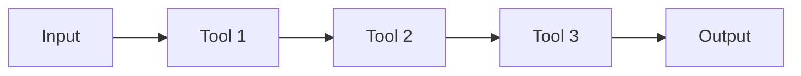
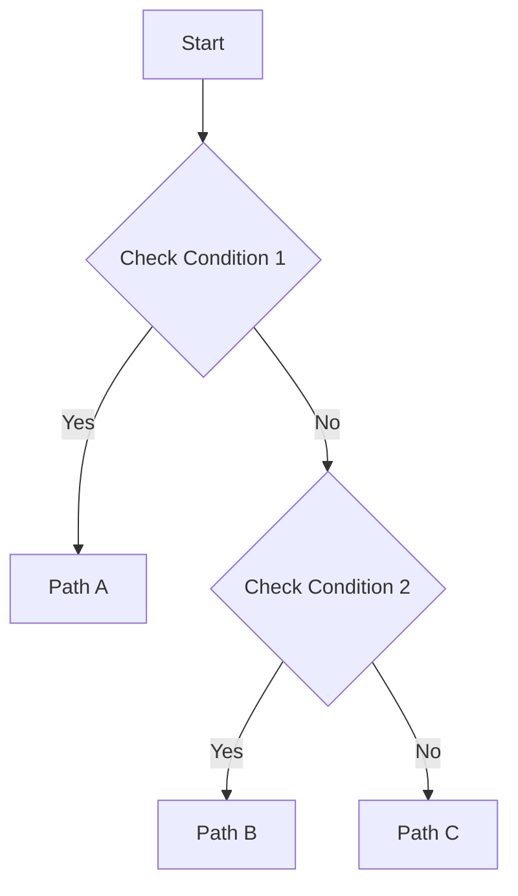

# 🔧 Custom Automation Workflows Guide

Complete guide to building, combining, and maintaining custom security automation workflows using the reverse-skill framework.

---

## 🎯 What You'll Learn

- How to combine multiple tools into unified workflows
- Creating reusable automation templates
- Building multi-stage attack chains
- Documenting custom workflows for team reuse
- Contributing workflows back to the community

---

## 📚 Table of Contents

1. [Understanding Workflow Architecture](#understanding-workflow-architecture)
2. [Creating Your First Custom Workflow](#creating-your-first-custom-workflow)
3. [Combining Multiple Tools](#combining-multiple-tools)
4. [Real-World Workflow Examples](#real-world-workflow-examples)
5. [Template Library](#template-library)
6. [Best Practices](#best-practices)
7. [Contributing Your Workflows](#contributing-your-workflows)

---

## Understanding Workflow Architecture

### The Skill Router System

The reverse-skill framework uses a **routing matrix** to direct tasks to the appropriate tools:

```
User Request
     ↓
routing.md (Match intent + target + toolchain)
     ↓
Appropriate SKILL.md
     ↓
Tool Execution
     ↓
Write-back to field-journal
```

### Workflow Components

Every custom workflow consists of:

1. **Entry Point** - How Claude routes to your workflow
2. **Tool Chain** - Sequence of tools to execute
3. **Decision Points** - Logic for handling different scenarios
4. **Output** - Reports, files, or further routing
5. **Documentation** - Knowledge capture for reuse

---

## Creating Your First Custom Workflow

### Example: Automated Web Application Security Assessment

Let's build a complete workflow that combines multiple tools.

### Step 1: Define the Workflow Structure

Create a new file: `skills/custom-workflows/web-app-full-assessment.md`

```markdown
---
name: web-app-full-assessment
description: |
  Complete web application security assessment combining:
  - Subdomain enumeration
  - Port scanning
  - Technology detection
  - Vulnerability scanning
  - Manual testing with Burp
  - Automated exploitation
  - Report generation
triggers:
  - "full web assessment"
  - "complete web pentest"
  - "automated web security scan"
---

# Web Application Full Security Assessment

## Scope Definition

### Input Required
- Target domain (e.g., example.com)
- Scope boundaries (subdomains included?)
- Authorization proof (must be documented in precedent-auth.md)
- Time constraints
- Rules of engagement

### Output Delivered
- Comprehensive vulnerability report
- Exploited vulnerabilities (PoC)
- Risk-ranked findings
- Remediation recommendations

## Workflow Chain

### Phase 1: Reconnaissance (Passive)
Tools: subfinder, amass, httpx, whatweb

1. **Subdomain Discovery**
   ```bash
   subfinder -d target.com -o subdomains.txt
   amass enum -d target.com >> subdomains.txt
   sort -u subdomains.txt -o subdomains_unique.txt
   ```

2. **Live Host Detection**
   ```bash
   cat subdomains_unique.txt | httpx -silent -o live_hosts.txt
   ```

3. **Technology Fingerprinting**
   ```bash
   cat live_hosts.txt | httpx -tech-detect -json -o tech.json
   ```

### Phase 2: Active Scanning
Tools: nmap, nuclei, nikto

1. **Port Scanning**
   ```bash
   nmap -iL live_hosts.txt -p- -T4 -oA nmap_scan
   ```

2. **Vulnerability Scanning**
   ```bash
   nuclei -l live_hosts.txt -t cves/ -t vulnerabilities/ -o nuclei_findings.txt
   ```

3. **Web Server Scanning**
   ```bash
   for host in $(cat live_hosts.txt); do
     nikto -h $host -output nikto_${host//[:\/]/_}.txt
   done
   ```

### Phase 3: Manual Testing (Burp Suite)

1. **Configure Burp Proxy**
   - Start Burp MCP server
   - Enable proxy on 127.0.0.1:8080

2. **Browse Application** (via browser-automation)
   ```
   Use Playwright to:
   - Navigate all pages
   - Fill all forms
   - Trigger all AJAX requests
   - Authenticate if needed
   ```

3. **Analyze Traffic**
   ```
   Use Burp MCP tools:
   - burp_proxy_history (get all requests)
   - burp_search_history (find sensitive data)
   - burp_scan_active (automated scanning)
   ```

### Phase 4: Exploitation
Tools: sqlmap, xsstrike, sstimap, burp intruder

1. **SQL Injection Testing**
   ```bash
   # Extract URLs with parameters from Burp
   # Feed to SQLMap
   sqlmap -u "https://target.com/page?id=1" --batch --risk=3
   ```

2. **XSS Testing**
   ```bash
   xsstrike --url https://target.com/search?q=test
   ```

3. **SSTI Testing**
   ```bash
   sstimap -u "https://target.com/template?name=test"
   ```

### Phase 5: Reporting
Tools: docs-generator

1. **Generate Findings Report**
   - Collect all scan outputs
   - Rank by severity
   - Add PoC for exploited vulns
   - Generate markdown report

2. **Create Diagrams**
   - Attack surface map (Mermaid)
   - Exploitation flow (sequence diagram)
   - Network topology (Graphviz)

## Automation Prompt

Use this prompt to run the full workflow:

```
I need a complete web security assessment on target.com.

Authorization: Already documented in precedent-auth.md
Scope: All subdomains under target.com
Time: Complete within 2 hours

Execute the full workflow:
1. Passive recon (subdomain + tech detection)
2. Active scanning (nmap + nuclei + nikto)
3. Manual Burp testing (automated browsing)
4. Exploitation (SQLMap + XSStrike + SSTI)
5. Generate comprehensive report with diagrams

Report any critical findings immediately.
```

## Checklist

Before claiming completion:

- [ ] All phases executed without errors
- [ ] At least 1 vulnerability found (or confirmed none exist)
- [ ] PoC provided for exploited vulnerabilities
- [ ] Comprehensive report generated
- [ ] Diagrams created (attack surface + flow)
- [ ] Write-back to field-journal completed
- [ ] Tools used documented in tool-index

## Known Pitfalls

| Problem | Solution |
|---------|----------|
| Subdomain enumeration times out | Reduce scope or use faster tools (subfinder only) |
| Nuclei produces too many false positives | Filter by severity: `-severity critical,high` |
| SQLMap hangs on WAF | Add `--random-agent --tamper=space2comment` |
| Burp MCP not responding | Check if Burp is running and extension loaded |

## Evolution Actions

After completing a real assessment with this workflow:

- [ ] Update tool list if new tools were used
- [ ] Add discovered pitfalls to the table
- [ ] Refine automation prompt based on effectiveness
- [ ] Share successful tactics in field-journal

```

---

## Combining Multiple Tools

### Pattern: Sequential Tool Chain

When tools must run in order (output of one feeds into next):

```markdown
## Workflow: APK Deep Analysis

1. **Extract APK** (apktool)
   ```bash
   apktool d app.apk -o extracted/
   ```

2. **Analyze Manifest** (manifest-summary.ps1)
   ```powershell
   powershell -File skills\apk-reverse\scripts\manifest-summary.ps1 -Path extracted\AndroidManifest.xml
   ```

3. **Decompile Java** (jadx)
   ```bash
   jadx -d decompiled/ app.apk
   ```

4. **Find Native Libraries** (file search)
   ```bash
   find extracted/lib -name "*.so" | tee native_libs.txt
   ```

5. **Analyze .so Files** (IDA Pro)
   For each .so file:
   - Open in IDA MCP
   - Survey binary
   - Look for crypto/network functions
   - Decompile suspicious functions

6. **Dynamic Analysis** (Frida)
   ```bash
   frida -U -f com.example.app -l hook_script.js
   ```

7. **Generate Report** (docs-generator)
   Compile all findings into markdown report
```

### Pattern: Parallel Tool Execution

When tools can run simultaneously:

```markdown
## Workflow: Multi-Vector Scanning

Run these in parallel (use background jobs):

**Job 1: Port Scanning**
```bash
nmap -p- target.com &
PID1=$!
```

**Job 2: Subdomain Enumeration**
```bash
subfinder -d target.com &
PID2=$!
```

**Job 3: Directory Bruteforce**
```bash
ffuf -u https://target.com/FUZZ -w wordlist.txt &
PID3=$!
```

Wait for all to complete:
```bash
wait $PID1 $PID2 $PID3
```

Merge results and proceed to next phase.
```

### Pattern: Conditional Branching

When the workflow path depends on findings:

```markdown
## Workflow: Adaptive Exploitation

1. Run initial scan
2. Analyze results:
   - If SQL injection found → Route to SQLMap workflow
   - If file upload found → Route to shell upload workflow
   - If XSS found → Route to XSS exploitation workflow
   - If nothing found → Route to manual testing workflow

3. Based on exploitation success:
   - If shell obtained → Privilege escalation workflow
   - If only information leak → Data exfiltration workflow
   - If exploitation failed → Try alternative vectors
```

---

## Real-World Workflow Examples

### Example 1: Malware Analysis Pipeline

**File:** `skills/custom-workflows/malware-analysis-pipeline.md`

```markdown
# Automated Malware Analysis Pipeline

## Trigger
"Analyze this malware sample" or "Full malware teardown"

## Workflow

### Stage 1: Initial Triage
1. File hash (SHA256)
2. VirusTotal lookup
3. File type detection
4. Packer detection
5. Initial strings extraction

### Stage 2: Static Analysis (IDA Pro)
1. Open in IDA with 600s timeout
2. Survey binary (architecture, imports, strings)
3. Identify crypto functions (CryptEncrypt, BCrypt*, etc.)
4. Identify network functions (socket, URLDownload, etc.)
5. Decompile key functions
6. Trace data flow

### Stage 3: Dynamic Analysis (Sandbox)
1. Run in isolated VM
2. Monitor:
   - Process creation
   - File system changes
   - Registry modifications
   - Network connections
3. Extract IOCs

### Stage 4: Behavioral Analysis
1. Map to MITRE ATT&CK framework
2. Identify persistence mechanisms
3. Trace C2 communication
4. Analyze encryption/obfuscation

### Stage 5: Reporting
1. Generate YARA rules
2. Create Suricata signatures
3. Extract all IOCs (IPs, domains, hashes)
4. Write comprehensive report
5. Create attack flow diagram
```

### Example 2: Bug Bounty Hunting Workflow

**File:** `skills/custom-workflows/bug-bounty-hunt.md`

```markdown
# Bug Bounty Hunting Workflow

## Target: Example.com Bug Bounty Program

### Phase 1: Asset Discovery (30 min)
- Subdomain enumeration (subfinder + amass)
- Port scanning (masscan for speed)
- Screenshot all web services (httpx)
- Technology detection

### Phase 2: Vulnerability Scanning (1 hour)
- Nuclei scan (all severity levels)
- Nikto scan on all web services
- Directory bruteforce (ffuf with multiple wordlists)
- Parameter fuzzing

### Phase 3: Manual Testing (2 hours)
- Test authentication mechanisms
- Check authorization (IDOR, privilege escalation)
- Test file upload functionality
- Test API endpoints
- Check for SSRF
- Test for XXE

### Phase 4: Deep Dive (Based on findings)
- If API found → Test for mass assignment, BOLA, BFLA
- If file upload found → Test for shell upload, XXE
- If WebSocket found → Test for injection, CSRF
- If GraphQL found → Test for introspection, batching attacks

### Phase 5: Exploitation & PoC
- Develop working exploit
- Record video PoC
- Document steps to reproduce
- Assess impact

### Phase 6: Submission
- Write clear vulnerability report
- Include impact analysis
- Provide remediation advice
- Submit to bug bounty platform
```

### Example 3: N-Day Exploit Development

**File:** `skills/custom-workflows/n-day-exploit-dev.md`

```markdown
# N-Day Exploit Development Workflow

## Input: CVE-XXXX-XXXXX

### Step 1: Research
1. Read CVE description
2. Find vendor advisory
3. Download patch diff
4. Identify vulnerable component

### Step 2: Patch Analysis (binary-diff)
1. Obtain both versions (vulnerable + patched)
2. Run binary diff (ghidriff or Diaphora)
3. Identify patched function
4. Analyze fix to understand vulnerability

### Step 3: Root Cause Analysis (IDA Pro)
1. Open vulnerable version in IDA
2. Decompile patched function
3. Trace data flow to vulnerability
4. Understand trigger conditions

### Step 4: Exploit Development (pwn-chain)
1. Craft trigger input
2. Verify crash
3. Develop exploit primitives
4. Build full exploit chain
5. Test reliability

### Step 5: Weaponization
1. Add shellcode payload
2. Implement evasion (ASLR bypass, etc.)
3. Test on multiple targets
4. Create Metasploit module

### Step 6: Documentation
1. Write technical analysis
2. Document exploitation steps
3. Create diagrams (ROP chain, memory layout)
4. Share with research community (responsibly)
```

---

## Template Library

### Template 1: Basic Workflow Template

**File:** `skills/custom-workflows/_template_basic.md`

```markdown
---
name: [workflow-name]
description: |
  [Brief description of what this workflow does]
triggers:
  - "[keyword 1]"
  - "[keyword 2]"
---

# [Workflow Name]

## Purpose
[Detailed description of when to use this workflow]

## Input Requirements
- [Required input 1]
- [Required input 2]

## Output Delivered
- [Output 1]
- [Output 2]

## Workflow Steps

### Phase 1: [Name]
Tools: [tool1], [tool2]

1. [Step 1]
   ```bash
   [command]
   ```

2. [Step 2]
   ```bash
   [command]
   ```

### Phase 2: [Name]
...

## Automation Prompt
```
[Natural language prompt to trigger this workflow]
```

## Completion Checklist
- [ ] [Criterion 1]
- [ ] [Criterion 2]
- [ ] Report generated
- [ ] Write-back completed

## Known Issues
| Problem | Solution |
|---------|----------|
| [Issue] | [Fix] |
```

### Template 2: Multi-Tool Integration Template

**File:** `skills/custom-workflows/_template_multi_tool.md`

```markdown
# [Workflow Name] - Multi-Tool Integration

## Tool Chain
1. [Tool A] → [Purpose]
2. [Tool B] → [Purpose]
3. [Tool C] → [Purpose]

## Data Flow


## Integration Points

### Tool 1 → Tool 2
- Output format: [format]
- Transformation needed: [description]
- Command:
  ```bash
  tool1 input | transform | tool2
  ```

### Tool 2 → Tool 3
...

## Error Handling

### If Tool 1 Fails
- Fallback: [alternative approach]
- Skip to: [Phase X]

### If Tool 2 Fails
...
```

### Template 3: Conditional Workflow Template

**File:** `skills/custom-workflows/_template_conditional.md`

```markdown
# [Workflow Name] - Conditional Execution

## Decision Tree



## Condition 1: [Description]
**Check:** [What to check]
**If True:** Execute Path A
**If False:** Continue to Condition 2

### Path A
1. [Step 1]
2. [Step 2]

## Condition 2: [Description]
...

## Convergence Point
After all paths complete, proceed to:
[Final steps common to all paths]
```

---

## Best Practices

### 1. Document Everything

**Good:**
```markdown
## Phase 1: Reconnaissance

Using subfinder to enumerate subdomains because:
- Fast (10x faster than amass for large domains)
- Good accuracy (misses ~5% that amass catches)
- No API keys needed

Command breakdown:
- `-d target.com` - target domain
- `-o subs.txt` - output to file
- `-silent` - suppress progress output

Expected runtime: 2-5 minutes
```

**Bad:**
```markdown
## Phase 1
Run subfinder
```

### 2. Include Error Handling

```markdown
## Error Handling

### If Tool X Times Out
1. Check if target is blocking scans
2. Reduce scan speed: `--rate-limit 50`
3. If still fails, use alternative tool Y

### If No Results Found
1. Verify target is reachable
2. Check scope configuration
3. Try alternative wordlists
4. Consider manual enumeration
```

### 3. Make It Reproducible

**Include:**
- Exact tool versions
- Wordlist sources
- Environment requirements
- API key setup (if needed)

```markdown
## Environment Setup

**Required Tools:**
- subfinder v2.5.5 (later versions have breaking changes)
- amass v3.21.2
- httpx v1.2.7

**Wordlists:**
- `/usr/share/seclists/Discovery/DNS/subdomains-top1million-110000.txt`

**API Keys (optional but recommended):**
```bash
export SUBFINDER_SOURCES="virustotal,shodan,censys"
export VIRUSTOTAL_API_KEY="your-key-here"
```
```

### 4. Capture Knowledge

After completing a workflow, write-back to field-journal:

```markdown
## Write-Back: [Date] [Project Name]

**Scenario:** Web application pentest

**What Worked:**
- Nuclei found SQLi in 5 minutes
- BurpSuite Intruder confirmed IDOR vulnerability
- Custom header injection bypassed WAF

**What Didn't Work:**
- SQLMap failed due to aggressive WAF
- Directory bruteforce timed out (too many requests)

**Lessons Learned:**
- Always try manual SQL injection first before SQLMap
- Use slower scan rates for WAF-protected targets
- Check robots.txt and sitemap.xml before bruteforcing

**New Tools Discovered:**
- `waf-bypass.py` script in payloader/ directory

**Improvements to Workflow:**
1. Add WAF detection phase before vulnerability scanning
2. Include manual testing steps in automation prompt
3. Create WAF bypass playbook
```

### 5. Optimize for Reuse

**Parameterize Your Workflows:**

```markdown
## Configurable Parameters

| Parameter | Description | Default | Override |
|-----------|-------------|---------|----------|
| TARGET | Target domain | (required) | `-t target.com` |
| TIMEOUT | Scan timeout | 300s | `--timeout 600` |
| THREADS | Thread count | 10 | `--threads 50` |
| WORDLIST | Directory wordlist | top1000.txt | `--wordlist big.txt` |

**Usage:**
```bash
./workflow.sh -t example.com --timeout 600 --threads 20
```
```

---

## Contributing Your Workflows

### Step 1: Test Your Workflow

Run it at least **3 times** on different targets to ensure it's reliable.

### Step 2: Document Thoroughly

Use the templates provided above. Include:
- Clear purpose and triggers
- All tool commands
- Expected outputs
- Error handling
- Completion checklist

### Step 3: Add to Routing Matrix

Edit `skills/routing.md` to add your workflow:

```markdown
| "my new workflow keyword" | `custom-workflows/my-workflow.md` |
```

### Step 4: Create Pull Request

Follow `skills/CONTRIBUTING.md`:
1. Create new branch
2. Add your workflow file
3. Update routing matrix
4. Update tool-index if using new tools
5. Submit PR with description

### Step 5: Share Knowledge

Write about your workflow:
- What problem it solves
- Success stories
- Lessons learned

Post in:
- GitHub Issues (as workflow showcase)
- Community forums (LINUX DO)
- Blog posts (if public)

---

## Advanced Patterns

### Pattern: Self-Healing Workflows

Workflows that detect and fix their own failures:

```markdown
## Self-Healing: Tool Failure Recovery

1. Try Tool A
2. If Tool A fails:
   - Log failure reason
   - Check if tool is installed (tool-index.md)
   - If missing → Call bootstrap
   - If installed but failing → Try Tool B (fallback)
3. If all tools fail:
   - Report to user
   - Suggest manual steps
   - Do not claim completion
```

### Pattern: Feedback Loops

Workflows that learn from results:

```markdown
## Feedback Loop: Adaptive Scanning

1. Run initial scan with default settings
2. Analyze results:
   - If WAF detected → Adjust scan strategy
   - If rate-limited → Reduce speed
   - If no results → Expand scope
3. Re-run with adjusted settings
4. Compare results
5. Write-back what adjustments worked
```

### Pattern: Parallel Orchestration

Managing multiple concurrent workflows:

```markdown
## Parallel Orchestration: Full Stack Pentest

Launch 3 parallel workflows:

**Workflow 1: Infrastructure** (nmap + nuclei)
**Workflow 2: Web Application** (burp + nikto)
**Workflow 3: Social Engineering** (email harvesting)

Sync points:
- All must complete Phase 1 before Phase 2 starts
- Critical findings halt other workflows
- Final report merges all results
```

---

## Next Steps

Now that you understand custom workflows:

1. **Start Small** - Build a simple 2-3 tool workflow
2. **Test Thoroughly** - Run it multiple times
3. **Document** - Use the templates provided
4. **Share** - Contribute back to the community
5. **Iterate** - Improve based on feedback

---

## Examples to Study

**Learn from existing workflows in the repo:**

- `skills/pentest-tools/src-hunter/` - 19 bug bounty playbooks
- `skills/attack-chain/SKILL.md` - Full red team workflows
- `CTF-Sandbox-Orchestrator/` - 40+ CTF competition workflows
- `skills/field-journal/*.md` - Real project write-backs

---

## 📞 Support

- **Questions:** [GitHub Discussions](https://github.com/Darkhearted007/reverse-skill/discussions)
- **Workflow Showcase:** [GitHub Issues](https://github.com/Darkhearted007/reverse-skill/issues) (tag: workflow)
- **Community:** [LINUX DO](https://linux.do)

---

**Happy Automating! 🚀**

Last updated: 2026-06-24
